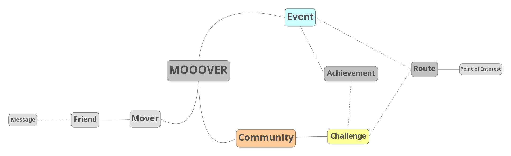

<h1 align="center">
	
 MOOOVER 

</h1>

# About

A mobile app aiming to make people more active with their friends.  
Join communities, take part in fun events and challenges that motivate you to be more active, visit your local area and interact with interesting people!

# Table of Contents

- [About](#about)
- [Requirements](#requirements)

# Requirements

## Mind map

## User features

- Sign up/in
- Communities joining/leaving/chatting
- Challenges participating (opt out/in)
- Profile modifications
- App settings
- See Mv(?) points (possibly used for vouchers and other things irl)
- See achievements
- Events participating
- Friends adding/removing/chatting
- Route following

## Target users

1. People that would not do outdoor activities on their own, but would with friends.  
2. People that are already active but want a more social and entertaining aspect to it.  
3. People that need more motivation to do sports.  
4. People that get bored by doing just physical activities.  

## How will it be used

- Mostly "on the go"
- While doing physical activities
- A bit at home

## Technical

- Mobile (+ web) application
- Involves some AI
	- path optimising
	- clustering for friend and communities recomandations
	- meteo stuff
	- placing points of interest (reinforcement learning with user feedback)
	- point of interest photo validation (image recogniton)
- Python server + database ?
- Android + iOS platforms in Flutter

### Entities

1. User:
	- Name
	- User name
	- Birth date
	- Fitness
	- Email
	- Phone number
	- Friends
	- Communities

## Flow

- Sign in/sign up with email + google + facebook + biometric
- Hub
	- Profile page
		- Achievements tab
	- Friends page
		- Messaging
	- Communities page
		- Challenges
		- Comm. chat
		- Map page
	- Events page

## Bachelor project documentation (useful stuff)

- Obesity problems

